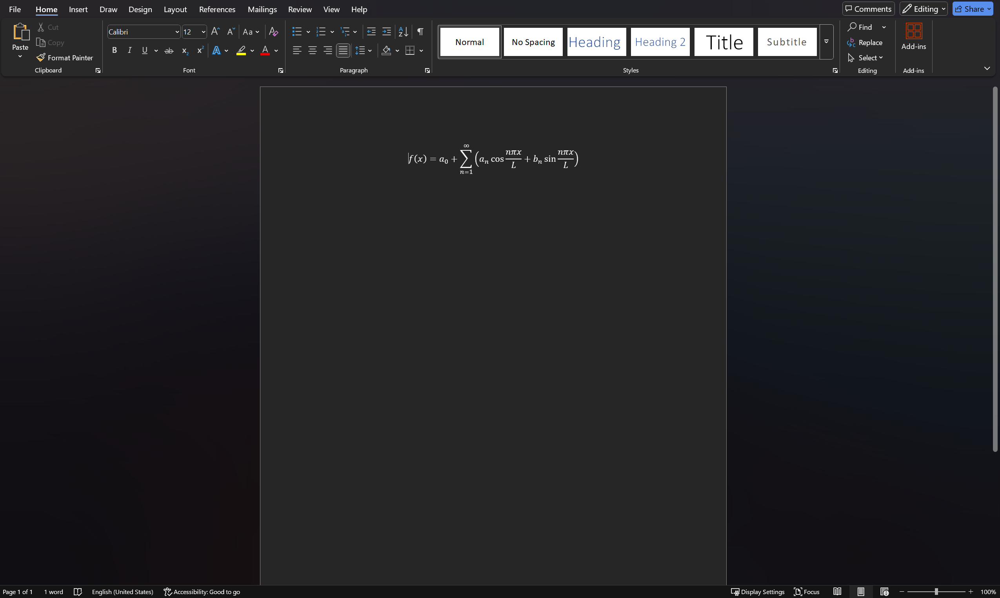

docxlatex
=========
docxlatex is a lightweight Python package for extracting text and mathematical equations from .docx files.

It does **not** convert the entire .docx file to a LaTeX source file, only the inserted equations.

Installation
------------
Install docxlatex using pip:

.. code-block:: console

    $ pip install docxlatex

Usage
-----
API
~~~
Usage is straightforward. For almost all cases you will only need the ``Document`` class.

.. code-block:: python

    from docxlatex import Document

Create a ``Document`` object by giving it the path to a .docx file, a path-like object, or a file-like object, and call the ``get_text()`` method:

.. code-block:: python

    doc = Document("path/to/your/document.docx")
    text = doc.get_text()
    equations = doc.equations # A list of strings containing the LaTeX code of the equations
    print(equations)

CLI
~~~
docxlatex also provides a CLI for quick extraction of text and equations from .docx files. You can use it as follows:

.. code-block:: console

    $ docxlatex path/to/your/document.docx

It also provides some options to customize the output:

.. code-block:: console

    $ docxlatex --help
    usage: docxlatex [-h] [--op OP] [--xml] [-l] ip

    positional arguments:
      ip          An absolute or relative path to the input .docx file

    options:
      -h, --help  show this help message and exit
      --op OP     An absolute or relative path to the output file (defaults to stdout)
      --xml       Dump the document's XML instead of converting to text
      -l          Specifies that the document has been converted to "Linear" format

Examples
--------
API
~~~
Here is a simple example of how an equation is extracted from a .docx file containing the Fourier series equation:

Using the API as shown above:

.. code-block:: python

    from docxlatex import Document
    doc = Document("./fourier_series.docx")
    text = doc.get_text()
    print(text)

This will output:

.. code-block:: console

    $ f\left( x \right)={a}_{0}+\sum_{n=1}^{∞}{\left( {a}_{n}\cos_{}^{}{\frac{nπx}{L}}+{b}_{n}\sin_{}^{}{\frac{nπx}{L}} \right)} $

CLI
~~~
Here is how you can use the CLI on the same file:

.. code-block:: console

    $ docxlatex ./fourier_series.docx

This will output the same LaTeX code to the console:

.. code-block:: console

    $ f\left( x \right)={a}_{0}+\sum_{n=1}^{∞}{\left( {a}_{n}\cos_{}^{}{\frac{nπx}{L}}+{b}_{n}\sin_{}^{}{\frac{nπx}{L}} \right)} $

Issues
------
docxlatex is not perfect, and you may encounter issues with certain .docx files, especially those with complex formatting or non-standard elements, or on older versions of Word.

If you find a bug or have a feature request, please open an issue on the `GitHub repository <https://github.com/hrushikeshrv/docxlatex/issues/new>`_. All bug reports and feature requests are welcome and greatly appreciated!
